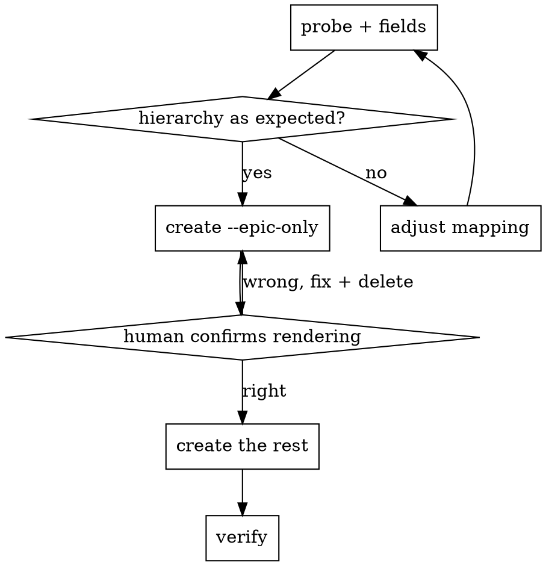

# jira-fu

## Overview

Turn a structured markdown backlog into a Jira epic with stories and sub-tasks,
then verify the hierarchy from the server rather than trusting the create calls.

**Core principle: probe, create one, verify, then bulk.** A create call that
returns 201 tells you a row was written. It does not tell you the issue is
parented where you asked, that the description rendered, or that a required
field was silently defaulted. Every one of those has to be read back.

## When to Use

- A plan, spec or backlog exists in markdown and needs to become Jira issues
- More than a handful of issues are involved, so hand-entry is slow and drifts
- Issues must nest: epic > story > sub-task
- Branches or PRs need real issue keys, so the keys have to come back out

**Do not use** for a single issue (open the browser), or for querying and
transitioning existing issues - this covers creation and verification only.

## The Trap This Avoids

Bulk-creating against an unfamiliar project fails in ways that are invisible
until you look:

| What happens | Why |
|---|---|
| Every issue rejected on a required field | Company-managed projects can require Epic Name, or a custom field with no default |
| Stories created but not under the epic | Older company-managed projects link epics through a custom field, not `parent` |
| Descriptions arrive as one ragged column | Jira renders a single newline as a hard line break |
| Descriptions arrive as literal `**bold**` | Jira renders wiki markup, not markdown |
| 39 issues created, half of them wrong | No verification step, so nobody looked |
| A retried run doubles everything | `create` is not idempotent and Jira has no bulk undo |

## Workflow



## Quick Reference

`jira_backlog.py` in this directory does all of it.

| Step | Command | Network |
|---|---|---|
| Check the parse | `jira_backlog.py parse BACKLOG.md` | no |
| Preview one description | `jira_backlog.py wiki BACKLOG.md 3.2` | no |
| Issue types and project style | `jira_backlog.py probe` | read |
| Required fields per type | `jira_backlog.py fields` | read |
| Create the epic alone | `jira_backlog.py create BACKLOG.md --epic-only` | write |
| Create the rest | `JIRA_EPIC_KEY=X jira_backlog.py create BACKLOG.md` | write |
| Check it landed | `jira_backlog.py verify` | read |

Environment: `JIRA_SITE`, `JIRA_PROJECT`, `JIRA_EMAIL`, `JIRA_TOKEN`. Nothing is
defaulted; the script refuses to guess a site or project.

## Credentials

Never ask for a token in the conversation and never echo one. It ends up in the
transcript, in scrollback, and in shell history.

```bash
# the human does this once, in their own shell
printf '%s' 'TOKEN' > ~/.jira-token && chmod 600 ~/.jira-token

# every later command reads it without printing it
JIRA_TOKEN="$(cat ~/.jira-token)" jira_backlog.py probe
```

The email is the other half of basic auth and is not secret. Ask for it; do not
guess it from git config, which is usually a different address.

## Backlog Format

```markdown
## EPIC: <summary>
Body becomes the epic description.

---

## Ticket 1: <summary>
Body becomes the story description.

### Task 1.1: <summary>
Body becomes the sub-task description.

### Task 1.2: <summary>
...
```

`---` or any later `## Heading` closes the current body, so a trailing summary
table is not swallowed into the last issue. Run `parse` first: it prints the
tree and warns about any issue whose description came out empty.

## Two API Facts That Will Bite

**Create with v2, search with v3.** `/rest/api/2/issue` takes `description` as a
plain string. The v3 endpoint requires Atlassian Document Format, which means
building a JSON document tree for every paragraph. But `/rest/api/2/search` was
removed in 2025 and returns a migration notice instead of results, so
verification must use `/rest/api/3/search/jql`.

**Write progress incrementally.** The script rewrites its output JSON after every
story. A run that dies at story 7 leaves a record of the 6 that exist. Re-running
without that record duplicates everything already created, and Jira has no
undo for bulk creation.

## Red Flags

- About to create more than one issue without having run `probe` and `fields`
- About to report success from create-call output rather than a `verify` read
- About to re-run `create` after any failure, without checking the output JSON
- About to ask the human to paste a token

## Real-World Impact

Filed an epic, 9 stories and 29 sub-tasks into a company-managed project in one
run: 38 of 38 children, no orphans. The v2 search endpoint returned a removal
notice mid-verification, which is why the script uses v3 for search.
